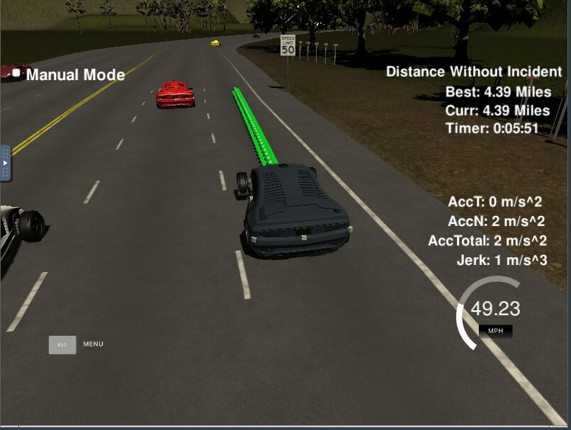
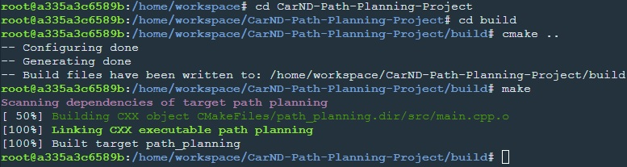
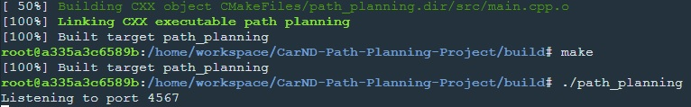
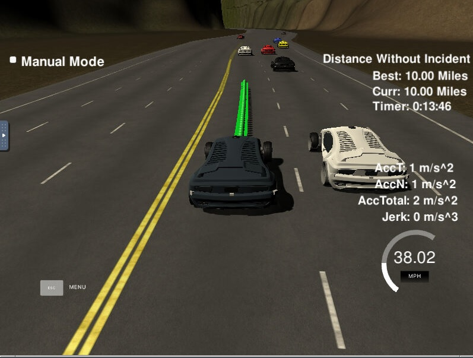
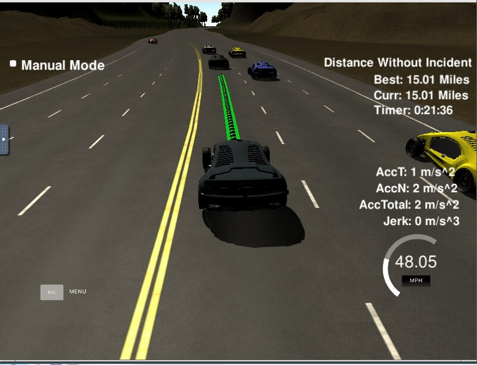

# CarND-Path-Planning-Project
Udacity Self-Driving Car Nanodegree - Path Planning Project



# Overview

In this project, the goal is to design a path planner that is able to create smooth, safe paths for a self driving car to follow along a 3 lane highway with traffic. A successful path planner will be able to keep inside its lane, avoid hitting other cars, and pass slower moving traffic all by using localization, sensor fusion, and map data. For this purpose, a simulator provided by Udacity([the simulator could be downloaded here](https://github.com/udacity/self-driving-car-sim/releases/tag/T3_v1.2)) is used to visualize the implementation of the path planning. The simulator sends car telemetry information (car's position and velocity) and sensor fusion information about the rest of the cars in the highway (Ex. car id, velocity, position). It expects a set of points spaced in time at 0.02 seconds representing the car's trajectory. The communication between the simulator and the path planner is done using [WebSocket](https://en.wikipedia.org/wiki/WebSocket). The path planner uses the [uWebSockets](https://github.com/uNetworking/uWebSockets) WebSocket implementation to handle this communication. The reference repository from Udacity can be found [here](https://github.com/udacity/CarND-Path-Planning-Project). The project rubric can be found [here](https://review.udacity.com/#!/rubrics/1971/view)

# Prerequisites

Project dependancies and installation requirements can be found in the [reference repository](https://github.com/udacity/CarND-Path-Planning-Project).

# Compiling and executing the project
In order to build and compile the code, from within the main repository directory, following steps can be taken:

- mkdir build && cd build to create and enter the build directory
- cmake .. && make to compile project
- ./path_planning to run code

Below is an example of the code compilation.


Below is an example of the code execution.


Now the path planner is running and listening on port 4567 for messages from the simulator. Next step is to open Udacity's simulator:
The simulator can the be opened and on pressing the select button, the highway and the ego vehicle appear.
As the code runs, the vehicle moves on the highway.

# [Rubic](https://review.udacity.com/#!/rubrics/1020/view) points

## Compilation

### The code compiles correctly.

No changes were made in the cmake configuration. A new file was added [src/spline.h](./scr/spline.h). It is the [Cubic Spline interpolation implementation](http://kluge.in-chemnitz.de/opensource/spline/): a single .h file that is an alternative to the quintic polynomial lesson in the classroom.

## Valid trajectories

### The car is able to drive at least 4.32 miles without incident.
A video of the simulation can be found [here](https://github.com/sidharth2189/CarND-Path-Planning-Project/blob/master/Path_Planning.mp4)
In the video, the vehicle has run for well above 7 miles without any incident.

Below are snapshots from a run on the simulator.





### The car drives according to the speed limit.
No speed limit red message is seen during the run. The car abides by the speed limit of 50 MPH.

### Max Acceleration and Jerk are not Exceeded.
Max jerk red message was not seen since the car does not exceed a total acceleration of 10 m/s^2 and a jerk of 10 m/s^3.

### Car does not have collisions.
The car does not come into contact with any of the other cars on the road. No collision red message is seen during the run.

### The car stays in its lane, except for the time between changing lanes.
The car stays in its lane most of the time but when it changes lane because of traffic.

### The car is able to change lanes
The car doesn't spend more than a 3 second length out side the lane lanes during changing lanes, and every other time the car stays inside one of the 3 lanes on the right hand side of the road.

## Reflection

Based on the provided code from the reference repository and classroom lessons, the path planning algorithms start at [src/main.cpp](https://github.com/sidharth2189/CarND-Path-Planning-Project/blob/master/src/main.cpp). The code could be separated into different functions to show the overall process, but I prefer to have everything in a single place to avoid jumping to different parts of the file or other files. In a more complicated environment and different requirements, more structure could be used. For now, comments are provided to improve the code readability.

The code consist of following important parts:

### Prediction [line 109 to line 281](https://github.com/sidharth2189/CarND-Path-Planning-Project/blob/master/src/main.cpp)
This part of the code deal with the telemetry and sensor fusion data. It intends to reason about the environment. In this case, we want to know four aspects of it:

- Is there a car in front of us blocking the traffic.
- Is there a car to the right of us making a lane change unsafe.
- Is there a car to the left of us making a lane change unsafe.
- What is the average speed of traffic in each of the lanes in order to find the fastest lane to shift when it is safe to do so

The first three questions are answered by calculating the lane that each of the other car is in and the position it will be in future by projecting its "s" co-ordinate (frenet). A lane shift is considered "unsafe" when a car's distance to the ego vehicle is less than 30 meters in front or behind of the latter.

The last question is answered by categorizing all the cars into lanes they are in and then averaging the sum of their velocities, lanewise. This gives us the average speed of each of the lane. This further helps us in building a cost function.

### Cost Design [line 183 to line 206](https://github.com/sidharth2189/CarND-Path-Planning-Project/blob/master/src/main.cpp)

The cost function designed here is mostly to account for efficiency and safety. It can be a good idea to be in the lanes with the highest avergae traffic speed. If we are not on this lane already and if it is safe to shift to this lane, we do so incrementally and this way the ego vehicle can evade any future bottleneck. 
```
// Cost design
          vector<double> costs;
          int min_cost = 9999999;
          double max_speed = 50;
          for (int j = 0; j < 3; j++)
          {
            double cost_ = 1 -  (lane_speeds_[j]/max_speed);
            if (collision)
            {
              cost_ = min_cost;
            }
            costs.push_back(cost_);
          }
          
          int fastest_lane = lane;
   
          for (int k = 0; k < costs.size(); k++)
          {
            if (costs[k] < min_cost)
            {
              min_cost = costs[k];
              fastest_lane = k;
            }
          }

```
### Behavior [line 283 to line 316](https://github.com/sidharth2189/CarND-Path-Planning-Project/blob/master/src/main.cpp)
This part decides what to do:
  - If we have a car in front of us, do we change lanes?
  - Do we speed up or slow down?
  - When to change to the lane with fastest average traffic speed?

Based on the prediction of the situation we are in, if there is ego vehicle detects a vehicle in our lane ahead of us and we can not change lane because of vehicles in other lanes less than a safe gap from us, the ego vehicle stays in the lane and gradually decreases speed. If however, it is safe to change lane, it does so. 
```
// Behaviour
          if(car_same_lane)
          {
            if ((!car_left_lane) && (lane > 0))
            {
              lane--;
            }
            else if ((!car_right_lane) && (lane < 2))
            {
              lane++;
            }
            else
            {
              ref_vel = ref_vel - 0.224; // equivalent of deceleration of 5 m/s^2
            }
          }    
          
```

By default, we will like to keep on travelling at our target speed of 49.5 MPH. And if ego vehicle is not at that speed and we do not have other vehilces less than safe distance ahead of us, we would like to reach this target speed incrementally. Further, we will also like to navigate in such a way that we plan to go ahead of the slow moving traffic. So, finding the fastest lane and shifting into it whenever it is safe to do so, is a way to go. This lane value is obtained from the cost function described one section above.

```
else 
          {
            if ( lane != fastest_lane ) 
            { // if we are not on the fastest lane.
              if ( (fastest_lane > lane) || (!car_right_lane) ) 
              {
                lane++; // Shift right.
              }
              if ( (fastest_lane < lane) || (!car_left_lane) ) 
              {
                lane--; // Shift left.
              }
            }
            if (ref_vel < 49.5) // desired speed = 49.5 mph
            {
              ref_vel = ref_vel + 0.224; // equivalent of acceleration of 5 m/s^2
            }
          }

```

### Trajectory [line 328 to line 444](https://github.com/sidharth2189/CarND-Path-Planning-Project/blob/master/src/main.cpp)
This code does the calculation of the trajectory based on the speed and lane output from the behavior, car coordinates and past path points.

First, the last two points of the previous trajectory (or the car position if there are no previous trajectory, lines 341 to 370) are used in conjunction three points at a far distance (lines 372 to 395) to initialize a spline calculation (line 398). To make the work less complicated to the spline calculation based on those points, the coordinates are transformed (shift and rotation) to local car coordinates. The spline helps smoothen the path avoiding jerk and acceleration limits.

In order to ensure continuity on the trajectory, the code builds a 50 point path and starts the new path with whatever previous path points were left over from the last cycle (line 421 to 444). Then new waypoints are appended, until the new path has 50 total waypoints. Using information from the previous path ensures that there is a smooth transition from cycle to cycle. But the more waypoints we use from the previous path, the less the new path will reflect dynamic changes in the environment.